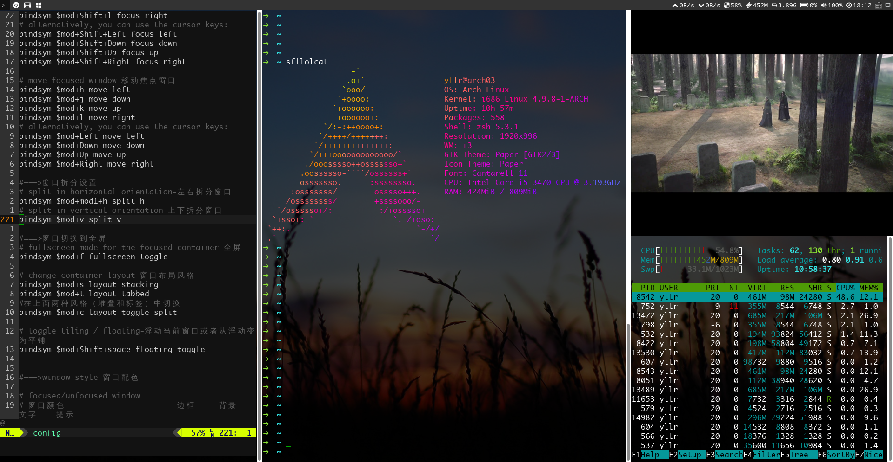

# hi-my-i3
根据网上两种优秀的配置组合成的一个i3配置，请两位前辈允许我的抄袭

---

## 依赖

- 调用conky作为i3bar输出
- dmenu启动程序
- feh显示壁纸
- xcompmgr透明插件（可选）
- infinality字体渲染美化（可选）
- pcmanfm轻量级文件管理器（可选）
- xfce4-terminal自带背景透明的轻量级终端模拟器（可选）
- scrot本配置默认使用的命令行截图工具（可选）
- mate-power-manager轻量级电源管理器方便调整亮度（可选）
- networkmanager,network-manager-applet,nm-connection-editor网络管理工具（可选）
- alsa-utils声音管理（可选）
- lxappearance窗体、图标、鼠标主题管理（可选）

## 字体

- Monaco:一个很好看的等宽英文字体，非常适用于写代码，若显示不佳请用infinality渲染
- font-awesome:开源的图标字体，可通过简单地复制粘贴使用，具体查看:
http://fortawesome.github.io/Font-Awesome/cheatsheet/

## 安装

先行安装所需程序:i3 dmenu feh conky

# 克隆hi-my-i3到本地
git clone https://github.com/yllr78/hi-my-i3.git
# cd 到hi-my-i3目录
cd hi-my-i3
# 安装
cp config ~/.config/i3/config
若已运行i3需要 `Alt+Shift+R` 重载入配置

## 启动配置

在用户目录下的.xinitrc文件的最后一句配置以下命令，以后开机登录后就可以用startx命令启动i3wm
exec i3

## 按键
$mod key使用的默认的Mod4，**一般指的是**windows键或super键或meta键。
此配置在i3wm的默认配置上稍作修改，参照了windows下的常用快捷键和vim按键习惯。

注：i3设置的demu默认快捷键为`$mod+d`，输入关键字即可查找相关程序，回车键确定启动当前选中（文字高亮）程序。

- 截图：`PrtSc`（PrtSc即PrintScreen键，参考的windwos下的截屏快捷键）。

- 文件管理器：`$mod+e`（配置文件中使用的是pcmanfm文件管理器，须安装pcmanfm，参考windows的文件管理器快捷键，e-explore）。

- 关闭窗口：`Alt+F4`（Alt一般是mod1键，参考windows的关闭窗口快捷键）。
- 隐藏和再现窗口：`$mod+minus`和`mod+plus`（minus即是减号所在键，plus即是加号所在键）。

- 调整窗口边框风格：
	- `$mod+n`有边框（就是一般的风格，有边框有顶部栏，n-normal）。
	- `$mod+u`无边框（本配置默认风格，打开新窗口也不会有边框，可自行设置，u-unnormal）。

	- `$mod+o`1像素边框（o-one pixel）。
	- `$mod+b`可在上面三种风格来回切换（b-border style）。
- 视窗焦点切换：
	`$mod+Shift+`h/j/k/l或者**上下左右箭头**（可以切换当前焦点，模仿vim）。
- 移动当前窗口：
	`$mod+`h/j/k/l**或者上下左右箭头**（可以将当前的窗口即焦点窗口向指定方向切换，模仿vim）。
- 分隔窗口：
	- `$mod+v`上下分割（i3wm默认，v-vertical）。
	- `$mod+Shift+h`左右分割（左右分割，默认风格就是左右分割）。
- 窗口布局风格：
	- `$mod+s`堆叠式（s-stacking）。
	- `$mod+t`标签式（t-tab）。
	- `$mod+c`平铺式（默认的风格），反复按下此快捷键可在上下分割平铺和左右分割平铺之间来回切换（c-change）。
- 相邻工作区切换:`$mod+tab`（后一个）或`alt+tab`（前一个）。

- 亮度和音量：

	`$mod+Shift+`加减键，用于增减音量。注：荧幕上不会出现图示，可参看bar中的显示，也可以用终端的`alsamixer`命令调整（需要安装alsa-utils）。
	`Fn+`笔记本的亮度加减键，用于调整荧幕亮度。（需要一个电源管理软件，推荐**mate-power-manager**）。

*i3wm的其他默认按键以及按键设置请参阅相关文档或查看config文件*。

## 壁纸和锁屏
壁纸图片放置路径是～/hi-my-i3/Pictures/wallpaper/wallpaper.jpg，不过本配置文件默认使用下文所述的随机壁纸实现方法，具体参看下文**随机壁纸**。

锁屏图片路径是~/hi-my-i3/Pictures/wallpaper/lock/lock.jpg。

需要安装**feh**！

*建议用一个固定的路径设置壁纸或锁屏，需要更换壁纸的时候将新图片命名位wallpaper放进去覆盖即可，比较方便（当然要注意后缀名是否一致）。*

### 随机壁纸
本配置**默认**使用一个wallpaper.sh的脚本随机更换壁纸。
将需要设定的壁纸放置到~/hi-my-i3/Pictures/wallpaper/目录下即可（如需更换壁纸路径，请在i3/config文件中根据注释说明更改）。

如需要使用固定壁纸，在**i3/config**中取消“设定壁纸图片”的命令的注释，并注释掉“自动更换壁纸”的命令。

**注意**
～/hi-my-i3/wallpaper.sh文件需要有可执行权限，如壁纸加载出问题，执行：
`chmod +x ～/hi-my-i3/wallpaper.sh`
给予执行权限。

可参考[archwiki-feh](https://wiki.archlinux.org/index.php/Feh_(%E7%AE%80%E4%BD%93%E4%B8%AD%E6%96%87))

## 电源管理
`$mod+alt+l`锁屏。

锁屏图片设置见上面的说明。

                                                  Allen Qiu
